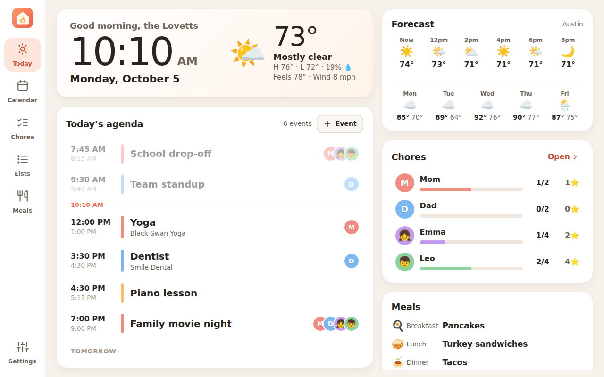
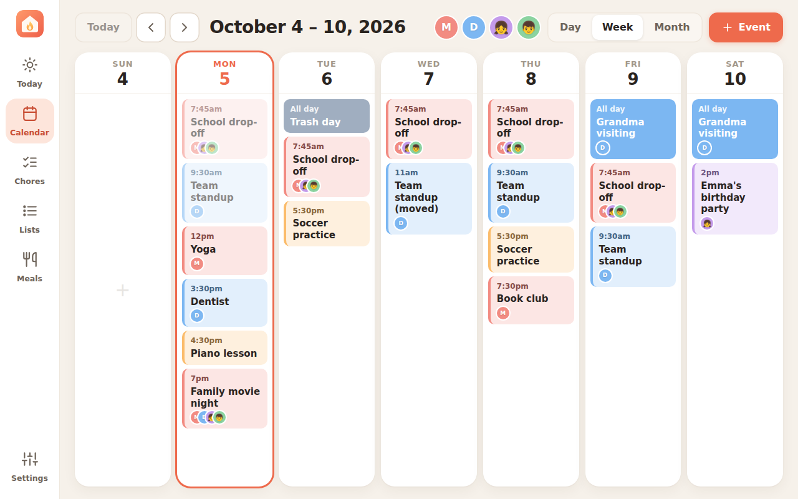
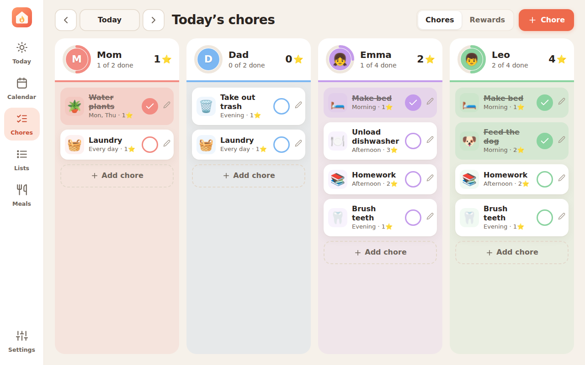

# Hearth

A self-hosted family wall calendar in the spirit of Skylight. Hearth runs on any computer in your house: Windows, macOS, Ubuntu (desktop or server), Raspberry Pi or Docker. You open it on a wall tablet or phone by typing that computer's IP address, and you can install it as an app.



| Week | Chores |
| --- | --- |
|  |  |

## What it does

- **Today dashboard**: a big clock and today's weather (hourly and 5-day forecast). It also shows today's agenda with a "now" line and a peek at tomorrow, each person's chore progress, and today's meals.
- **Calendar**: day, week and month views, color-coded by family member. You can filter by person, swipe to change dates, and add events that repeat.
- **Google, Outlook and iCloud sync** through each calendar's private iCal link. It refreshes automatically, and cached events still show when the internet is down.
- **Chores and rewards**: a chore chart with a column per person. Chores can repeat daily, on chosen days or once, and can be tagged morning, afternoon or evening. Kids earn stars (with confetti when they finish) and spend them on rewards you set up.
- **Lists** (groceries, to-dos) and a **weekly meal planner**.
- **Live sync**: when a chore is checked off on a phone, the wall tablet shows it about a second later.
- **Parent PIN**: kids can check off chores and add to lists, while settings, chores and rewards need the PIN.
- **Made for a wall screen**: installs as a full-screen app and keeps the screen awake. It can dim at night and goes back to Today after a few idle minutes. It keeps working through Wi-Fi blips.
- **No cloud account, no build step, no native modules.** Everything is stored in one JSON file on your computer.

## Quick start on Windows

1. Install **Node.js LTS** from <https://nodejs.org> (the default options are fine).
2. Download this repository (**Code → Download ZIP**) and unzip it, for example to `C:\Hearth`.
3. Double-click **`scripts\windows\start-hearth.bat`**. The first run installs what it needs. The window then shows something like:

   ```
   Hearth 1.0.0 is running

   On this computer:   http://localhost:3000
   On your network:    http://192.168.1.50:3000   (secure: https://192.168.1.50:3443)
   ```

4. Let other devices in. Right-click PowerShell → **Run as administrator** and run:

   ```powershell
   powershell -ExecutionPolicy Bypass -File C:\Hearth\scripts\windows\open-firewall.ps1
   ```

   This adds inbound rules for ports 3000 and 3443 on Private networks. If Windows has your Wi-Fi marked as Public, the script tells you how to switch it.
5. On the tablet, open the `http://192.168.x.x:3000` address from the window, or scan the QR code it prints.
6. In Hearth, go to **Settings** and add your family, your calendars and your town for the weather.

**Start Hearth automatically** when you sign in:

```powershell
powershell -ExecutionPolicy Bypass -File C:\Hearth\scripts\windows\install-autostart.ps1
# add -Kiosk to also open it full screen in Edge on this PC (Alt+F4 exits), or -Remove to undo
```

> Stop Hearth with **Ctrl+C** in its window. If you close the window instead and later see "port already in use", the error message tells you the `netstat` / `taskkill` commands to clear it.

## Quick start on Ubuntu / Ubuntu Server

This works on Ubuntu 22.04, 24.04 and 26.04 LTS (desktop or server), and also on Debian and Raspberry Pi OS. Run these as your normal user, not with `sudo`. The installer asks for your password when it needs it.

```bash
# Get the code: git clone it, or download the ZIP and unzip it. Then:
cd hearth
./install.sh
```

`install.sh` asks before each change to the system. It:

1. **Sets up Node.js.** Ubuntu's own package is too old (v12 on 22.04, v18 on 24.04), so it offers Node.js 22 LTS from NodeSource, the official Linux packages. If you already have Node 20+ (from nvm, snap and so on), it uses that.
2. **Installs Hearth's packages** with `npm ci`.
3. **Creates a `hearth` systemd service.** It runs as your user, starts at boot, restarts if it crashes, and is sandboxed so it can only write to its data folder.
4. **Opens the firewall** if `ufw` (or firewalld) is on. Ports 3000 and 3443 are opened to private home-network addresses only.
5. **Offers `avahi-daemon`**, so tablets can use `http://<server-name>.local:3000`, which keeps working if the IP changes. Ubuntu Desktop already has it; Server doesn't.
6. **Prints the addresses** to open on your tablet.

Day-to-day commands:

```bash
systemctl status hearth          # is it running?
journalctl -u hearth -f          # live log
sudo systemctl restart hearth    # restart
git pull && ./install.sh         # update (keeps your data)
./install.sh --uninstall         # remove the service (keeps your data)
```

> **Time zone:** Ubuntu Server often starts out on UTC. Picking your town under Settings → Weather sets Hearth's time zone. You can also set the server's own with `sudo timedatectl set-timezone America/Chicago`.

**Use the Ubuntu machine itself as the display.** On Ubuntu Desktop (or Raspberry Pi OS with a desktop), run `./install.sh --kiosk`. It adds a sign-in item that opens Hearth full screen in Chromium, Chrome or Firefox (it offers to install Chromium if none is found). It also turns off screen blanking and auto-lock. Turn on *Settings → Users → Automatic Login* so the screen comes back by itself after a power cut. Alt+F4 leaves kiosk mode.

## Quick start on macOS

This works on Intel and Apple Silicon Macs. macOS 13 Ventura or newer is recommended, because current Node.js releases need it.

1. Put Hearth in a folder in your home folder, such as `~/hearth`. **Don't** use Desktop, Documents, Downloads or iCloud Drive, because macOS blocks background services from reading those folders. The installer warns you if you do.
2. In Terminal:

   ```bash
   cd ~/hearth
   ./install.sh
   ```

   If Node.js is missing, it offers `brew install node` (when Homebrew is installed), or points you to the macOS Installer at nodejs.org.
3. It sets up a **launch agent**: Hearth starts when you sign in, restarts if it crashes, and stops the Mac from idle-sleeping while it runs. If the macOS firewall is on, it lets Node.js accept connections; this asks for your password.

```bash
launchctl kickstart -k gui/$(id -u)/com.hearth.server   # restart
tail -f ~/Library/Logs/Hearth/hearth.log                # live log
git pull && ./install.sh                                # update
./install.sh --uninstall                                # remove (keeps your data)
```

For a Mac mini that should run unattended, turn on *System Settings → Users & Groups → Automatically log in*. Also turn on *Energy → Start up automatically after a power failure*.

**Use the Mac itself as the display.** `./install.sh --kiosk` opens Hearth full screen in Chrome or Edge when you sign in, and keeps the display awake. If you only use Safari, open `http://localhost:3000` and choose *File → Add to Dock* (macOS 14 Sonoma or newer) to get Hearth as its own app.

**Just want to try it** without a background service? Run `./scripts/start.sh`. On a Mac you can also double-click `scripts/macos/start-hearth.command` in Finder (if macOS refuses, right-click → Open). It runs until you press Ctrl+C.

## Docker

```bash
docker compose up -d
```

Edit `docker-compose.yml` first:

- Set `TZ` to your time zone.
- Set `PUBLIC_HOSTS` to the LAN IP your tablets will use, so the HTTPS certificate covers it.
- On a Linux host you can use `network_mode: host` instead. Hearth then finds the LAN IP by itself.

Data is kept in `./data`. The image builds on x86 and ARM machines (Raspberry Pi, Apple Silicon).

## Put it on the tablet as an app

Browsers only offer **Install app**, full-screen mode and keep-screen-on over HTTPS. A home server has no public domain, so Hearth creates its own small certificate authority the first time it runs. You trust it once per device:

1. On the tablet, open Hearth → **Settings → Connect devices → Download certificate**.
2. Install it:
   - **Android**: Settings → Security → *Encryption & credentials* → *Install a certificate* → **CA certificate**.
   - **iPad / iPhone**: open the profile in Settings → Install. Then go to General → About → *Certificate Trust Settings* and turn on **Hearth Local CA**.
   - **Windows**: double-click the file → Install Certificate → *Trusted Root Certification Authorities*.
   - **Fire tablet**: Settings → Security → *Install from storage*.
3. Open the `https://192.168.x.x:3443` address, then use **Add to Home screen** / **Install**.

The **Connect devices** screen shows step-by-step instructions for each kind of device, plus QR codes.

Other ways to install it:

- **The computer running Hearth** doesn't need the certificate. `http://localhost:3000` counts as secure, so Edge and Chrome can install it directly (Safari: *File → Add to Dock*).
- **Other Macs and Linux PCs**: the Connect devices screen has certificate steps for them too (Keychain Access on a Mac; Chrome's or Firefox's certificate settings on Linux).
- **Android without a certificate**: open `chrome://flags`, enable *Insecure origins treated as secure*, and add `http://192.168.x.x:3000`.

**Tips for a wall tablet**

- Give the Hearth computer a fixed IP (a DHCP reservation in your router) so the address never changes. If the IP does change, Hearth issues a new server certificate on the next start. The CA you installed stays valid.
- Keep the tablet plugged in and set its display timeout to "never". Hearth asks the browser to keep the screen awake.
- Turn on **Settings → General → Dim the screen at night**.
- Android's *App pinning*, or a kiosk browser such as Fully Kiosk, keeps kids in the app.

## Connect Google and Outlook calendars

Hearth reads calendars through their **private iCal (.ics) link**. You don't need an account login or API keys. Add each one under **Settings → Calendars**, then pick whose calendar it is so its events use that person's color.

- **Google Calendar** (from a computer): open [calendar.google.com](https://calendar.google.com). Hover over the calendar, then click ⋮ → *Settings and sharing* → *Integrate calendar*. Copy **Secret address in iCal format**.
- **Outlook.com / Microsoft 365**: open Outlook on the web → Settings ⚙ → Calendar → *Shared calendars* → **Publish a calendar**. Choose *Can view all details*, then copy the **ICS** link.
- **iCloud**: in the Calendar app, tap ⓘ next to the calendar, turn on *Public Calendar*, then *Share Link*.

Hearth checks for changes every 15 minutes (5 to 60, set under Settings → Calendars). It handles repeating events, exceptions, cancellations and Outlook's Windows time-zone names. **The sync is read-only.** Events you create in Hearth live in Hearth and are not pushed back to Google or Outlook.

Treat the secret links like passwords. Hearth never sends them back to the browser.

## Settings you can change with environment variables

| Variable | Default | Meaning |
| --- | --- | --- |
| `PORT` | `3000` | HTTP port |
| `HTTPS_PORT` | `3443` | HTTPS port |
| `HTTPS` | on | Set to `false` to serve HTTP only |
| `HOST` | `0.0.0.0` | Interface to listen on (all, so the LAN can reach it) |
| `DATA_DIR` | `./data` | Where data and certificates are stored |
| `PUBLIC_HOSTS` | *(none)* | Extra IPs or hostnames for the certificate and Connect screen, comma-separated |
| `TZ` | system | Time zone (mainly useful in Docker) |

On Windows (PowerShell): `$env:PORT=3001; node server\index.js`

## Your data

Everything lives in the `data` folder:

- `hearth.json` holds family, chores, events, lists, meals and settings. `hearth.json.bak` is the previous copy.
- `calendar-cache.json` holds the last download of each synced calendar.
- `certs/` holds the local certificate authority and server certificate. Keep `ca.key` private.

On Linux and macOS the folder is readable only by the account that runs Hearth. It holds your PIN hash and your private calendar links.

To back up, copy the folder. To move to another computer, copy it next to Hearth there.

## Troubleshooting

| Problem | Fix |
| --- | --- |
| Tablet can't open the address | Make sure both devices are on the same Wi-Fi, not a guest network. Run `open-firewall.ps1` as Administrator and check that Windows calls the network *Private*. Check the IP with `ipconfig`. |
| "Port 3000 is already in use" | Hearth is probably already running (as a service on Linux/Mac). **Windows:** `netstat -ano \| findstr :3000`, then `taskkill /PID <pid> /F`. **Linux:** `systemctl status hearth`, or `sudo ss -ltnp 'sport = :3000'`. **Mac:** `lsof -nP -iTCP:3000 -sTCP:LISTEN`. Or set `PORT`. |
| Linux: tablet can't connect | Run `sudo ufw status`. Re-run `./install.sh` and answer yes to the firewall question, or run `sudo ufw allow from 192.168.0.0/16 to any port 3000,3443 proto tcp`. |
| Linux: service won't start | Check `journalctl -u hearth -n 50`. If you removed or upgraded the Node.js it was installed with (nvm), re-run `./install.sh`. |
| Mac: "Operation not permitted" in the log | Hearth is inside Desktop/Documents/Downloads/iCloud. Move it to `~/hearth` and re-run `./install.sh`. |
| Mac: Hearth stops when the lid closes | Laptops sleep with the lid closed whatever Hearth asks for. Use a Mac that stays open, or a desktop Mac. |
| "Not secure" on the https address | Install the certificate from Settings → Connect devices on that device. |
| Calendar shows an error | Use the **iCal / .ics** link, not the normal web address of the calendar. |
| No weather | Set your town in Settings → Weather. Hearth needs internet to fetch forecasts from Open-Meteo. |
| Forgot the parent PIN | Stop Hearth, set `"pinHash": null` in `data/hearth.json`, then start it again. |

## How it's built

- **Server**: Node.js 20+ and Express. Data is a JSON file with atomic writes. Calendar parsing and recurrence use [ical.js](https://github.com/kewisch/ical.js), weather comes from [Open-Meteo](https://open-meteo.com), and live updates use Server-Sent Events.
- **App**: Preact and htm, loaded as plain ES modules, so there's no bundler or build step. A service worker loads from the network first and falls back to its cache. There's a manifest for install, and screen wake lock where the browser allows it.
- **HTTPS**: a ~150-line DER encoder plus `node:crypto` creates the CA and server certificate. No OpenSSL install is needed.

```
install.sh   Linux/macOS installer (Node.js, packages, service, firewall, kiosk)
server/      API, calendar sync, weather, certificates, storage
public/      the app (index.html, app/, css/, sw.js, manifest)
scripts/     start.sh; windows/ (start, firewall, autostart, kiosk); linux/ and macos/ kiosk launchers
test/        node --test suites (npm test)
```

## Compared with Skylight

Hearth covers the calendar, chore chart, rewards, lists, meal plan and a Today dashboard. It doesn't yet include:

- Two-way sync, meaning events created on the tablet don't go back to Google or Outlook. That needs an OAuth app registration with each provider.
- A photo-frame screensaver.
- A separate phone app. Instead, open the same address on your phone and add it to the home screen.

## License

MIT
